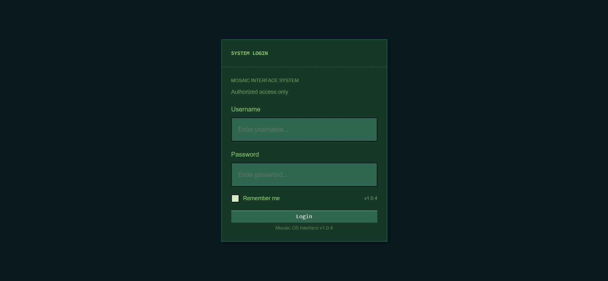
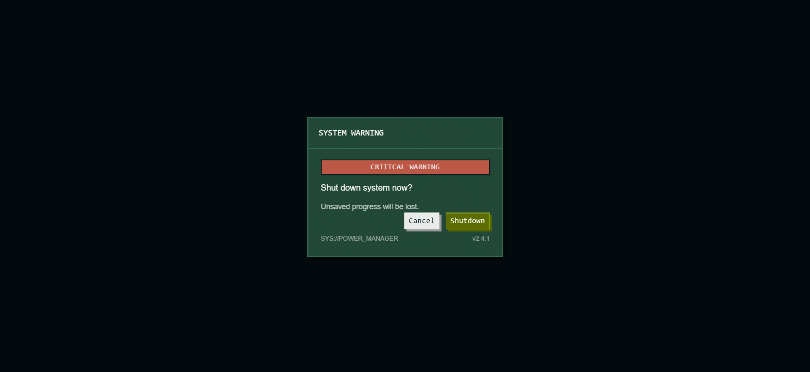
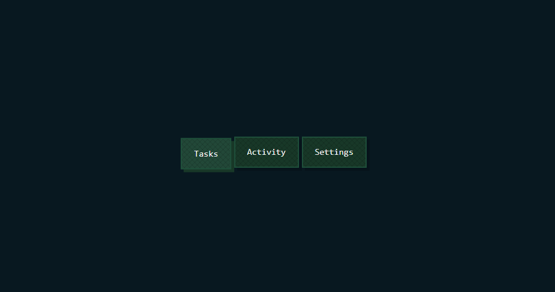

# Mosaic UI

Retro pixel-inspired React UI kit built with React, TypeScript and Storybook.

Mosaic UI combines chunky retro interfaces, pixel aesthetics and reusable modern UI patterns for dashboards, forms and desktop-like interfaces.

📚 Storybook:
https://mosaic-ui-kit.vercel.app/

## Preview

### Retro Login Form



### System Shutdown



### Tabs Showcase



## Features

- Retro pixel-inspired visual style
- Token-driven theme system
- Reusable React + TypeScript components
- Storybook documentation
- Variant-based styling
- Retro desktop and system UI examples
- Consistent spacing, shadows and surfaces

## Installation
<!-- ```bash
npm install

---
```md id="v8jlwm"
Run Storybook locally:

```bash
npm run storybook -->

## Components

### Core Components

- Button
- Input
- Textarea
- Checkbox
- Badge
- Tabs
- Card
- Panel
- Modal

### Example Screens

- CreateTaskForm
- RetroLoginForm
- SystemShutdown

## Storybook

Storybook is used to document components, foundations and interactive examples.

Included sections:

- Foundations
- Components
- Examples

## Examples

Mosaic UI includes several retro-inspired example screens built with reusable components:

- Retro login form
- System shutdown dialog
- Task creation form
- Desktop-style modal layouts
- Retro tabs and panel compositions

## Tech Stack

- React
- TypeScript
- Storybook
- CSS Modules
- Theme tokens and variant maps

## Goals

Mosaic UI was created as an experiment in retro-inspired interface design, combining pixel aesthetics with reusable modern React components and design-system principles.
